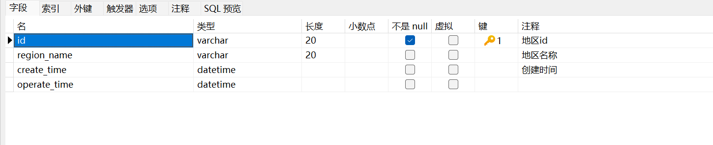

### 2024-12-24
# mashuai

dim层
    首先讲主流数据通过flinkcdc读取,然后通过binlog监控读取出来,将主流数据和配置表(广播流)
数据读取出了,如果配置表和主流表能够关联起来,就是维度表,然后创建表,表格创建成功后,再讲数据写入
hbase,完成dim层
    期间报了一个找不到主键:
去mysql中设置主键即可
    
    报一个空值:
        原因是因为没有连接配置表,所以会报空值

最后将结果打包部署:
    
